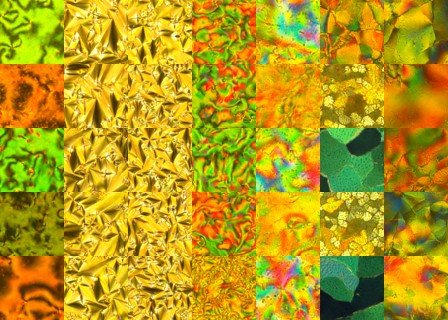
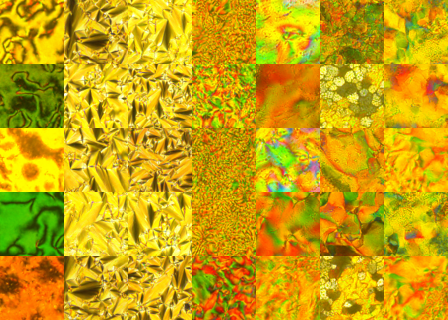
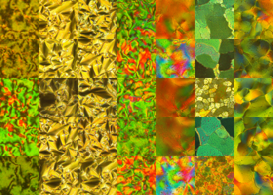

# LQ_Diffusion
Sampling Liquid Crystal Textures with Denoising Diffusion Probabilistic Models

Using Improved Diffusion as a benchmark, we evaluated our approach on a novel liquid crystal dataset. We observed that linear noise schedules yield lower losses in the later stages of training for this dataset.

Generated Textures (linear schedule):

Generated Textures (cosine schedule):

Generated Textures (logistic schedule):

